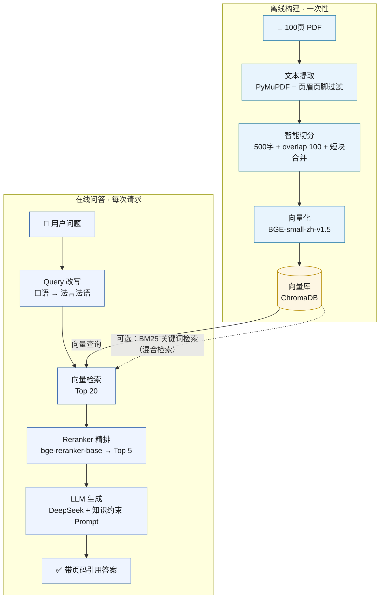

# RAG 项目：基于 100 页 PDF 的精准问答系统

> 检索增强生成（Retrieval-Augmented Generation）：先检索知识库，再让 LLM 基于资料作答，解决幻觉与知识过时问题。

## 项目简介

本项目从零搭建一个 RAG 系统，实现对 100 页级 PDF 文档的精准问答。核心链路为 **文本切分 → 向量化检索 → Reranker 精排 → LLM 生成**，回答附带来源页码，并配套可量化的评估体系（Hit@5 / Hit@10 / MRR）。

**最终效果**：20 题评估集上，启用 Query Rewriting 后 **Hit@5 与 Hit@10 均达 100%，MRR 0.8417**。

## 功能特性

| 能力 | 说明 |
|---|---|
| 📄 PDF 解析 | PyMuPDF 提取文本，过滤页眉页脚广告与空白页 |
| ✂️ 智能切分 | 500 字 / overlap 100 / 短块合并 / 超长段落二次切分 |
| 🔢 本地向量化 | BGE-small-zh-v1.5，CPU 可跑，无需调用外部 embedding 服务 |
| 🗄️ 持久化向量库 | ChromaDB 本地存储，构建一次可复用 |
| 🎯 两阶段检索 | 向量粗排 Top20 → BGE-Reranker 精排 Top5 |
| 💬 带引用生成 | DeepSeek 生成，回答标注来源页码，低幻觉约束 |
| 📊 量化评估 | Hit@5 / Hit@10 / MRR 自动计算 |

## 架构图



## 技术栈

| 组件 | 选型 | 用途 |
|---|---|---|
| PDF 解析 | PyMuPDF (`pymupdf`) | 文本提取、页眉页脚过滤 |
| 切分 | 自研（段落 + 句子边界） | 500 字 / overlap 100 / 短块合并 |
| Embedding | `BAAI/bge-small-zh-v1.5` | 中文向量化，CPU 可跑 |
| 向量库 | ChromaDB | 持久化存储与余弦相似度检索 |
| Reranker | `BAAI/bge-reranker-base` | 交叉编码精排，提升命中精度 |
| LLM | DeepSeek API（OpenAI 兼容） | 基于检索上下文生成带引用答案 |
| 评估 | 自研脚本 | Hit@5 / Hit@10 / MRR 计算 |

## 项目结构

```
rag-project/
├── .env                        # API Key 配置（勿提交到 git）
├── data/
│   └── your_doc.pdf            # 你的 100 页 PDF
├── chunks/
│   └── chunks.json             # 切分结果（含页码）
├── db/                         # ChromaDB 持久化目录（自动生成）
├── eval/
│   └── questions.json          # 评估问题集（含 answer_page / answer_articles）
├── parse_and_chunk.py       # 第一步：PDF 提取 + 切分
├── build_vector_db.py       # 第二步：向量化 + 入库 + 检索测试
├── rag_pipeline.py          # 第三步：Reranker + 生成（交互问答）
└── evaluate.py              # 第四步：评估（Hit@5 / MRR）
└── diagnose.py              # 第五步：用于评估后针对性调试
```

## 快速开始（部署运行）

### 环境要求

- Python 3.10+（推荐 3.12）
- 可联网（下载模型 + 调用 API）

### 1. 安装依赖

```bash
pip install pymupdf chromadb sentence-transformers openai python-dotenv
# 可选（后续优化用）：pip install rank-bm25 jieba
```

### 2. 配置 API Key

创建 `.env` 文件：

```env
DEEPSEEK_API_KEY=你的key
DEEPSEEK_BASE_URL=https://api.deepseek.com
DEEPSEEK_MODEL=deepseek-chat
```

> 首次运行会自动下载 BGE 模型（约 100MB + Reranker 400MB），下载慢可设置镜像：`set HF_ENDPOINT=https://hf-mirror.com`

### 3. 放入 PDF 并依次运行

```bash
# ① PDF 提取 + 切分（产出 chunks/chunks.json）
python parse_and_chunk.py

# ② 向量化入库 + 检索测试（产出 db/）
python build_vector_db.py

# ③ 启动交互问答（输入 q 退出）
python rag_pipeline.py

# ④ 跑评估（Hit@5 / Hit@10 / MRR）
python evaluate.py
```

### 4. 交互问答示例

```
请输入问题（输入 q 退出）：房子已经抵押给银行，还能卖给其他人吗？

[向量检索] 召回 20 个候选块
[Reranker] 精排后取 Top 5：
  1. 第59页 | rerank=0.660 | 第四百零六条 抵押期间，抵押人可以转让抵押财产...
[回答]
根据资料（第59页）：抵押期间，抵押人可以转让抵押财产，当事人另有约定的按照其约定；抵押财产转让的，抵押权不受影响。
```

## 评估结果

基于民法典 PDF（176 页）与 20 题评估集：

| 指标 | 未用 Query Rewriting | 使用 Query Rewriting |
|---|---|---|
| **Hit@5** | 17/20 = 85.0% | **20/20 = 100%** |
| **Hit@10** | 19/20 = 95.0% | **20/20 = 100%** |
| **MRR** | 0.6646 | **0.8417** |

> 评估口径：`answer_page` 由 PyMuPDF 逐条扫描核实；可用 `answer_articles`（条款号）做跨版本校验。

## 调优手段（实战经验）

| 症状 | 根因 | 对策 |
|---|---|---|
| Top20 未命中 | 提问口语化，与文档术语差异大 | **Query Rewriting**（口语→法言法语，高效且快速）；或 BM25 精确匹配与向量检索取并集 |
| Top20 命中但 Top5 未命中 | Reranker 排序偏差 | 打印 reranker 排名定位；换 `bge-reranker-large` 或调整 prompt |
| 回答质量差 | 切分粒度不当 | 调整 chunk_size / overlap；**特定文档按关键词切分**——如条例类文档按"第X条"切分效果最佳 |
| 回答不完整 | 生成 prompt 过度防御 | 要求"先完整引用资料中所有相关要点，再指出资料未覆盖部分" |

## 测试数据

| 类型 | 来源 | 说明 |
|---|---|---|
| 民法典 PDF（176 页） | [国家法律法规数据库](https://wb.flk.npc.gov.cn/flfg/PDF/bd53dd912c1048f2aecbaa229238334b.pdf) | 条款结构化，适合验证"第X条"精确检索 |
| 评估集（20 题） | 项目内 `eval/questions.json` | 覆盖全部 7 编，含难度分级与期望要点 |

## 后续优化方向（TODO）

- [ ] **BM25 混合检索**：与向量检索取并集，补足关键词精确匹配（规划中）
- [ ] **法律文档按条款切分**：`第X条` 一条一块，替代通用 500 字切分
- [ ] **扩展测试集**：技术文档（Python 官方文档）、小说（三国演义）验证切分鲁棒性
- [ ] **生成质量评估**：期望要点覆盖率 + 幻觉率（LLM-as-Judge 自动评分）

## 常见问题

| 问题 | 解决 |
|---|---|
| 下载 PDF 报 403 / 证书错误 | 政府网站证书过期常见，curl 加 `-k` 跳过证书验证（仅限公开文档） |
| 提取的文本比页面少很多 | 可能是扫描版（需 OCR）或复杂排版，改用 `get_text("blocks")` 提取 |
| 切分后第一块很短 | 封面/目录页正常；页眉页脚广告需按位置+关键词过滤 |
